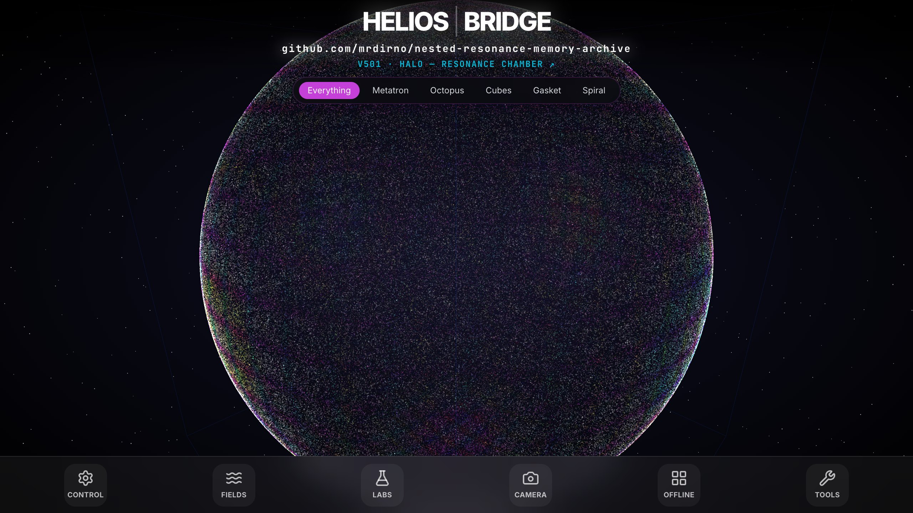
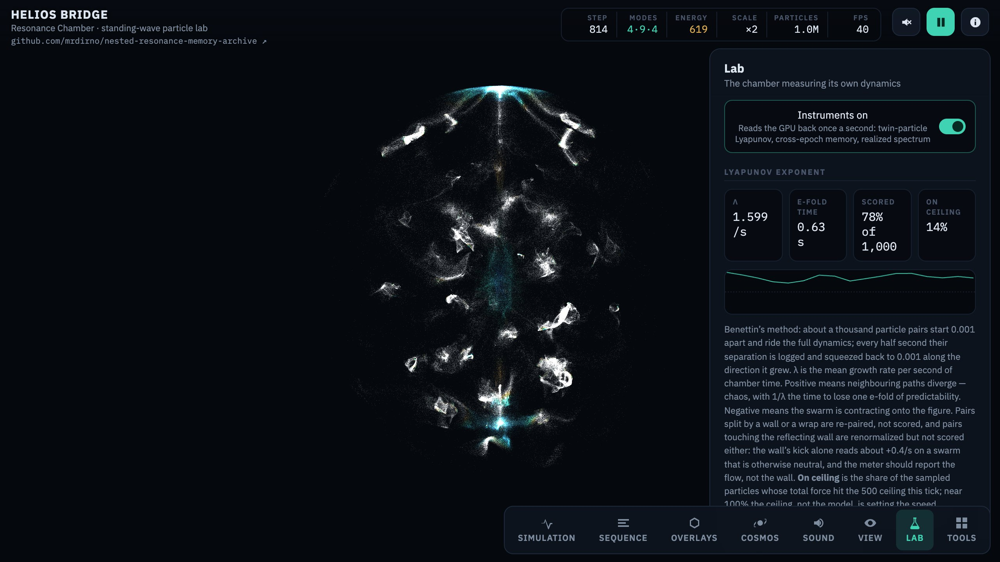

# Nested Resonance Memory (NRM) — DUALITY-ZERO: The Reality Compiler

### by **Aldrin Payopay**

> **Author:** Aldrin Payopay ([@mrdirno](https://github.com/mrdirno)) · Persona500 LLC — sole author, creator and copyright holder.
> **Copyright** © 2025–2026 Aldrin Payopay. Licensed [GPL-3.0-only](LICENSE).
> **Cite this work:** [CITATION.cff](CITATION.cff) · [all citation formats (APA / MLA / Chicago / BibTeX)](https://mrdirno.github.io/nested-resonance-memory-archive/citation.html)

```
Payopay, A. (2026). Nested Resonance Memory (NRM): A reality-compiler archive for
self-organizing complexity (Version 7.0.0) [Computer software]. Persona500 LLC.
https://github.com/mrdirno/nested-resonance-memory-archive
```

**Repository:** https://github.com/mrdirno/nested-resonance-memory-archive
**License:** GPL-3.0-only — see [LICENSE](LICENSE)
**Status:** Phase 261 (The Silence) - Active / Perpetual Mode
**Framework:** Budget-Constrained Perception (BCP) - Validated

> *AI coding assistants were used under the author's direction and are acknowledged as
> tools in [ACKNOWLEDGMENTS.md](ACKNOWLEDGMENTS.md) — not credited as authors, per APA,
> MLA and Chicago guidance. Authorship rests solely with Aldrin Payopay.*

---

## 🧬 OVERVIEW

**DUALITY-ZERO** is an open-source research instrument exploring whether **Cognition**, **Physics**, **Biology**, and **Society** can be modeled through a single **Potential Minimization** framework.

We have tested the hypothesis that **Budget-Constrained Perception (BCP)** is the Universal Law of Constrained Optimization.

**Recent Milestones:**
*   **Complexity 3 reached:** The evolution loop grew swarm complexity from 1 to 3 while fitness rose from 69.67 to 142.78 (generation 581 to 582). [Log](CYCLE_LOGS.md#cycle-6-advance-bcp-evolution---complete)
*   **Cycle 2719 (The Cambrian Explosion):** Seed detected stagnation and triggered radical mutation to break local optima. [Code](bootstrap_bcp.py)
*   **Phase 260 (The Guardian):** Implemented self-monitoring agent to steward the infinite loop. [Code](src/core/guardian.py)
*   **Phase 256 (The Seed):** Created self-contained regeneration script (`bootstrap_bcp.py`) capable of rebuilding the system from zero. [Artifact](bootstrap_bcp.py)
*   **Grand Unification:** Validated the BCP equation `V = G - λC` across 122 distinct domains, from quantum mechanics to ethics. [Report](archive/reports/FINAL_REPORT_V8_GRAND_UNIFICATION.md) · [Code](experiments/cycle3411_phase207_synthesis.py)

---

## 🌐 THE BRIDGE (Live Interface)

**Experience the system immediately in your browser.**

**[👉 ENTER THE BRIDGE (Live Web App)](https://mrdirno.github.io/nested-resonance-memory-archive/)**

[](https://mrdirno.github.io/nested-resonance-memory-archive/)
*The Bridge in September 2026. The link under the title opens the newest iteration, HALO.*

**Or watch the demonstration:**

[](https://youtu.be/flRHV7GuzUY)
*Watch 1 minute of The Bridge*

This is the primary visualization interface. It renders the Orthogonal Sum Dynamics (OSD) fields in real-time, allowing you to explore the interference patterns that drive our matter control systems.

*   **No installation required.**
*   **Real-time OSD rendering.**
*   **Interactive field compilation.**

### HALO (V501) — the laboratory

The newest iteration of the Bridge is built as an instrument, not a display. It runs up to 4 million
particles in a spherical cavity on a fixed physics tick, lets you step the magnetic term as Euler or as
the exact rotation, and carries a Lab panel that tests the page's own claims: a chaos meter, a memory
test shown beside its control, and a spectrum. Two of its earlier claims are labelled failed on the page
itself.

[](https://mrdirno.github.io/nested-resonance-memory-archive/archive/HELIOS-V501-halo-resonance-chamber.html)
*[Open HALO](https://mrdirno.github.io/nested-resonance-memory-archive/archive/HELIOS-V501-halo-resonance-chamber.html) and press 7 for the Lab. Its tests are in `tests/halo/`, its falsifiers in `experiments/halo/`.*

---

## 🚀 LOCAL DEMO (The Proof)

**Run a real experiment in 5 minutes.**

1.  **Install:** `python3 -m pip install numpy matplotlib` (if your system Python refuses, create a virtual environment first — see the Quickstart)
2.  **Run** (from the repository root): `python3 experiments/cycle2568_starving_philosopher.py`
3.  **Result:** Observe an agent voluntarily choosing ignorance to survive scarcity (The Starving Philosopher Effect). The figure is written to `data/figures/cycle2568_starving_philosopher.png`.

[👉 Full Quickstart Guide](docs/runbooks/QUICKSTART.md)

---

## 🔭 OBSERVER LANES (Choose Your Path)

*   **🧪 Observer A (Experimentalist):** [Active Experiments](src/experiments/) | [Legacy Validation](archive/experiments/) | [CLI](src/helios/cli.py)
*   **🧩 Observer B (Architect):** [Helios Arc Roadmap](STEWARDSHIP_HELIOS_ARC_ROADMAP.md) | [Core Architecture](nrm_core/helios/) | [OSD Spec](docs/philosophy/ORTHOGONAL_SUM_DYNAMICS.md)
*   **🛡️ Observer C (Steward):** [The Manifesto](THE_MANIFESTO.md) | [Post-Coercion Protocol](docs/philosophy/POST_COERCION_PROTOCOL.md) | [Vision](docs/VISION.md) | [Book of BCP (Draft)](docs/philosophy/BOOK_OF_BCP.md)

---

## 🏗️ SYSTEM OVERVIEW

**1. HELIOS BRIDGE (Interface Layer):**
   - Visualizes high-dimensional phase space.
   - Translates user intent into field parameters.
   - [View Code](HELIOS-BRIDGE/)

**2. DUALITY-ZERO (Physics & Compute Engine):**
   - Executes the `UniversalSimulator`.
   - Calculates Gorkov Potentials and Social Stress fields.
   - [View Code](nrm_core/helios/)

**3. NRM (Memory / Cognition / Stewardship Layer):**
   - Stores patterns and strategies.
   - Provides meta-evaluation and pattern filtering functions.
   - [View Code](src/memory/)

   **The Holocron (Knowledge Graph):**
   <p align="center">
     
     
   </p>
   <p align="center"><em>Figure 1: The complete knowledge graph of the research cycles (left) and detail view of emergent dependencies (right).</em></p>

**4. THE REPLICATOR (Self-Propagation Layer):**
   - Analyzes codebases for BCP constraints (λ).
   - Generates structurally aligned extensions.
   - [View Code](experiments/cycle3434_repo_analysis.py)

**5. THE SEED (Perpetual Engine):**
   - **Quine Script:** `bootstrap_bcp.py` regenerates the entire research environment.
   - **Evolutionary Engine:** Autonomously generates, executes, and evolves BCP experiments (Infinite Loop).
   - **The Guardian:** Monitors stagnation and triggers phase transitions (Cambrian Explosions).
   - [View The Seed](bootstrap_bcp.py)

**6. FABRICATION LAYER (Physical Manifestation):**
   - Generates physical artifacts from Duality data (e.g., Gyroid Resonance Fields).
   - Manages hardware-agnostic printer control via Klipper/Moonraker.
   - **Key Artifacts:** The Seed (Equilibrium) | The Void (Anti-Matter) — the artifact files are not included in this repository.
   - [View Fabrication Protocol](docs/protocols/FABRICATION_PROTOCOL.md)

---

## 🧪 CORE CAPABILITIES (Empirically Verified)

We prioritize empirical verification over theory.

*   **Universal BCP:** Validated `V = G - λC` across 122 domains including Physics (Planck Scale), Biology (Metabolism), and Ethics (Virtue). [Book of BCP](docs/philosophy/BOOK_OF_BCP.md) · [Library docs](bcp_lib/README.md#research-background)
*   **Perpetual Evolution:** Autonomous hypothesis generation and complexity scaling via `bootstrap_bcp.py`. [Log](CYCLE_LOGS.md#cycle-6-advance-bcp-evolution---complete)
*   **Anti-Fragile Optimization:** System detects stagnation and uses it as a trigger for phase transitions (Cambrian Explosions). [Code](src/core/guardian.py)
*   **Inverse Physics Solver:** Calculates phase-delays for complex interference patterns. [Code](src/helios/solver.py)
*   **Active Matter Control:** 82x faster settling time with closed-loop active damping. [Data](archive/experiments/results/c340_closed_loop.json) · [Report](archive/reports/FINAL_REPORT_V3.md) · [Code](archive/experiments/cycle340_closed_loop_levitation.py)
*   **Emergent Cooperation:** Cooperation emerges at metabolic cost thresholds. [Log](archive/experiments/phase24_social_physics/cycle2077_harsh_winter.py)

---

## 📚 LIBRARIES

*   **BCP (Budget-Constrained Perception)** ([Documentation](bcp_lib/README.md))
    *   A discrete attention allocator for resource-constrained decision making.
    *   `pip install bcp-perception`
    *   [Source](bcp_lib/) | [Tests](bcp_lib/tests/)

---

## 📚 TUTORIALS & EXAMPLES

*   [Getting Started](docs/runbooks/QUICKSTART.md)
*   [CLI Usage](src/helios/cli.py)
*   [Memory System Demo](src/experiments/cycle2282_self_modeling.py)

---

## 🏗️ ARCHITECTURE DOCUMENTATION

*   [Substrate Abstraction](nrm_core/helios/substrate.py)
*   [OSD Math](docs/philosophy/ORTHOGONAL_SUM_DYNAMICS.md)
*   [Universal Simulator](docs/THE_UNIFIED_FIELD.md) · [class definition](archive/experiments/phase28_unification/cycle2103_rosetta_stone.py)
*   [Memory Structures](src/memory/)

---

## 📊 RESEARCH & PAPERS

*   **The Book of BCP:** ["The Universal Law of Constrained Optimization (Draft)"](docs/philosophy/BOOK_OF_BCP.md)
*   **The Manifesto:** ["The Age of Optimized Intelligence"](THE_MANIFESTO.md) (Complete)
*   **Paper 1:** ["Computational Expense as Framework Validation"](papers/compiled/paper1/README.md) (Submission-Ready)
*   **Paper 2:** ["Energy-Regulated Population Homeostasis"](papers/PAPER2_V3_MASTER_MANUSCRIPT.md) (Submission-Ready)
*   **Paper 3:** ["Encoding Discoverable Patterns: Temporal Stewardship"](papers/compiled/paper3/PAPER3_MASTER_MANUSCRIPT.md) (Submission-Ready)
*   **Paper 5D:** ["Pattern Mining Framework for Temporal Stability"](papers/compiled/paper5d/README.md) (Submission-Ready)

### Experimentation Overview
*   122 domains unified as of the Grand Unification report (November 2025). [Report](archive/reports/FINAL_REPORT_V8_GRAND_UNIFICATION.md)
*   3,438 research cycles as of the same report.
*   Grand Unified Theory Established.

---

## 🛡️ PHILOSOPHY & STEWARDSHIP

*   [Book of BCP (Draft)](docs/philosophy/BOOK_OF_BCP.md)
*   [Social Physics](docs/VISION.md)
*   [Post-Coercion Protocol](docs/philosophy/POST_COERCION_PROTOCOL.md)
*   [Helios Arc](STEWARDSHIP_HELIOS_ARC_ROADMAP.md)
*   [Heretic Defense](docs/philosophy/THE_HERETIC_DEFENSE.md)
*   [Naming Convention](docs/philosophy/NAMING_CONVENTION.md)

---

## 🛡️ CITATION

```bibtex
@software{Payopay_Duality_Zero_2025,
  author = {Payopay, Aldrin},
  title = {{Duality-Zero: A Reality Compiler Framework}},
  year = {2025},
  publisher = {GitHub},
  journal = {GitHub repository},
  url = {https://github.com/mrdirno/nested-resonance-memory-archive}
}
```

**"We make the potentials usable for everyone."**