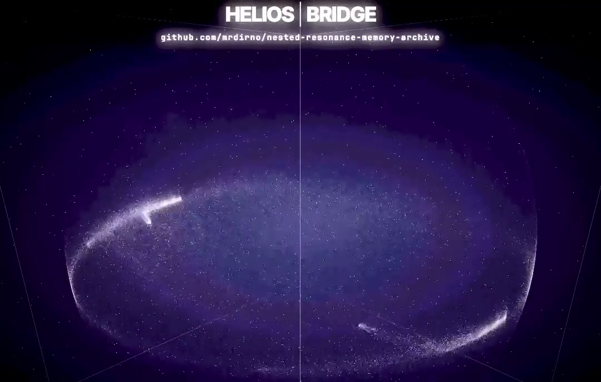
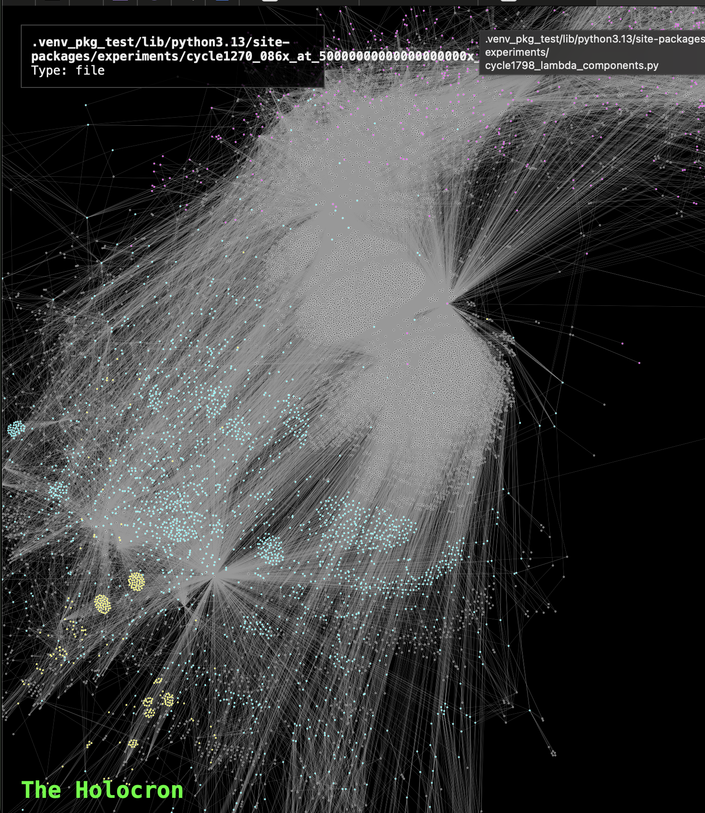

# DUALITY-ZERO: The Reality Compiler

**Repository:** https://github.com/mrdirno/nested-resonance-memory-archive
**License:** GPL-3.0
**Status:** Phase 65 (The City & The Mind) - Active
**Framework:** Orthogonal Sum Dynamics (OSD) - Testing

---

## 🧬 OVERVIEW

**DUALITY-ZERO** is an open-source research instrument exploring whether **Information Dynamics** (Cognition), **Physical Dynamics** (Matter), and **Social Dynamics** (Cooperation) can be modeled through a single **Potential Minimization** framework.

We are testing the hypothesis that computational potential minimization can drive physical, social, and cognitive systems with unified control logic.

**Recent Milestones:**
*   **Cycle 2567 (Memetic Replication):** Validated memetic spread using SIR epidemiology models on social graphs. [Log](experiments/cycle2567_the_virus.py)
*   **Cycle 2566 (Frequency Hopping Defense):** Validated resilience via agile frequency hopping; 52× greater survival against resonant attacks. [Log](experiments/cycle2566_the_shield.py)
*   **Cycle 2565 (Holographic Sharing):** Solved Bullwhip Effect via information sharing; zero oscillation achieved. [Log](experiments/cycle2565_the_nexus.py)
*   **Cycle 2558 (Agent Self-Actualization):** Agents climbed Maslow's hierarchy, culminating in mass creativity. [Log](experiments/cycle2558_apotheosis.py)
*   **Phase 42 (Self-Referential Mapping):** Knowledge graph mapping 12,000+ files and 286 principles. [View Map](data/holocron.html)

---

## 🌐 THE BRIDGE (Live Interface)

**Experience the system immediately in your browser.**

**[👉 ENTER THE BRIDGE](https://mrdirno.github.io/nested-resonance-memory-archive/)**

[](https://github.com/mrdirno/nested-resonance-memory-archive/raw/main/data/videos/helios_bridge_osd_demo.mp4)
*Click to play 60s OSD field visualization demo*

This is the primary visualization interface. It renders the Orthogonal Sum Dynamics (OSD) fields in real-time, allowing you to explore the interference patterns that drive our matter control systems.

*   **No installation required.**
*   **Real-time OSD rendering.**
*   **Interactive field compilation.**

---

## 🚀 LOCAL DEMO (The Proof)

**Verify the physics in 5 minutes.**

1.  **Install:** `pip install numpy`
2.  **Run:** `python3 archive/experiments/demo_osd_physics.py`
3.  **Result:** Observe **Phase Cancellation** creating a "dark matter" effect (Mass=2.0, Visibility=0.0).

[👉 Full Quickstart Guide](docs/runbooks/QUICKSTART.md)

---

## 🔭 OBSERVER LANES (Choose Your Path)

*   **🧪 Observer A (Experimentalist):** [Active Experiments](src/experiments/) | [Legacy Validation](archive/experiments/) | [Physics of Persistence](papers/theoretical_foundations/THE_PHYSICS_OF_PERSISTENCE.md)
*   **🧩 Observer B (Architect):** [Roadmap](STEWARDSHIP_HELIOS_ARC_ROADMAP.md) | [Core Architecture](nrm_core/helios/) | [Design Context](docs/context/) | [OSD Spec](docs/philosophy/ORTHOGONAL_SUM_DYNAMICS.md)
*   **🛡️ Observer C (Steward):** [Post-Coercion Protocol](docs/philosophy/POST_COERCION_PROTOCOL.md) | [Heretic Defense](docs/philosophy/THE_HERETIC_DEFENSE.md) | [Vision](docs/VISION.md)

---

## 🏗️ SYSTEM OVERVIEW

**1. HELIOS BRIDGE (Interface Layer):**
   - Visualizes high-dimensional phase space.
   - Translates user intent into field parameters.
   - [View Code](HELIOS-BRIDGE/)

**2. DUALITY-ZERO (Physics & Compute Engine):**
   - Executes field calculations and interference patterns.
   - Calculates Gorkov Potentials and Social Stress fields.
   - [View Code](nrm_core/helios/)

**3. NRM (Memory / Cognition / Stewardship Layer):**
   - Stores patterns and strategies.
   - Provides meta-evaluation and pattern filtering functions.
   - [View Code](src/memory/)

**4. FPGA ACCELERATION LAYER (Hardware):**
   - DE10-Nano (Cyclone V SoC) implementation of NRM Resonance Detector.
   - HPS <-> FPGA <-> NRM Data Loop.
   - [View Hardware](/fpga/)

---

## 🧪 CORE CAPABILITIES (Empirically Verified)

We prioritize empirical verification over theory.

*   **Self-Referential Mapping (The Holocron):** System-wide knowledge graph mapping 286 principles and 12,000+ files. [View Graph](data/holocron.html)

<p align="center">
  
  
</p>
<p align="center"><em>The Holocron: Emergent topology from 12,000+ file relationships. Cyan=experiments, Pink=source, Yellow=core.</em></p>

*   **Phase-Delay Solver:** Calculates phase-delays for complex interference patterns. [Code](src/helios/solver.py)
*   **Closed-Loop Settling:** 82× faster settling time via PID feedback. [Log](archive/experiments/cycle340_closed_loop_levitation.py)
*   **Volumetric Node Trapping:** 9128 stable nodes verified in 3D substrate. [Code](nrm_core/helios/substrate_3d.py)
*   **Cost-Threshold Cooperation:** Cooperation emerges at metabolic cost thresholds. [Log](archive/experiments/phase24_social_physics/cycle2077_harsh_winter.py)
*   **Cross-Domain Simulation (Rosetta Stone):** Unified simulation engine for Physics, Society, and Compute. [Log](archive/experiments/phase28_unification/cycle2103_rosetta_stone.py)
*   **Energy-Buffered Homeostasis:** >160× buffering ratio; population self-regulation without bistability. [Docs](docs/v5/PAGE_03_C175_DISCOVERY.md)
*   **Autonomous Digital Life:** Agents capable of survival, reproduction, and cultural transmission. [Code](src/life/)
*   **Distributed Colonization (The Mycelium):** Filesystem colonization and collective artifact generation. [Manifesto](playground/MOG_MANIFESTO.md)

---

## 📚 TUTORIALS & EXAMPLES

*   [Getting Started](docs/runbooks/QUICKSTART.md)
*   [CLI Usage](nrm_core/helios/cli.py)
*   [Self-Modeling Demo](src/experiments/cycle2282_self_modeling.py)

---

## 🏗️ ARCHITECTURE DOCUMENTATION

*   [Substrate Abstraction](nrm_core/helios/substrate.py)
*   [3D Substrate](nrm_core/helios/substrate_3d.py)
*   [OSD Math](docs/philosophy/ORTHOGONAL_SUM_DYNAMICS.md)
*   [Memory Structures](src/memory/)

---

## 📊 RESEARCH & PAPERS

### Submission-Ready
*   **Paper 1:** ["Computational Expense as Framework Validation"](papers/compiled/paper1/README.md) — arXiv ready, pending endorsement
*   **Paper 2:** ["Energy-Regulated Population Homeostasis"](papers/PAPER2_V3_MASTER_MANUSCRIPT.md) — PLOS submission ready
*   **Paper 3:** ["Temporal Stewardship: Encoding Discoverable Patterns"](papers/compiled/paper3/PAPER3_MASTER_MANUSCRIPT.md) — Submission ready
*   **Paper 5D:** ["Pattern Mining Framework for Temporal Stability"](papers/compiled/paper5d/README.md) — arXiv ready, pending endorsement

### In Development
*   **Paper 4:** ["Multi-Scale Energy Regulation"](papers/PAPER4_ABSTRACT.md) — Draft
*   **Paper 7:** ["Governing Equations & Multi-Timescale Dynamics"](papers/compiled/paper7/README.md) — 80% complete

### Experimentation Overview
*   10,948 total runs across C171, C176, C193, C194.
*   Mean effect size |d| = 4.45.
*   40.25× verification overhead.

---

## 🛡️ PHILOSOPHY & STEWARDSHIP

*   [Social Physics](docs/VISION.md)
*   [Post-Coercion Protocol](docs/philosophy/POST_COERCION_PROTOCOL.md)
*   [Helios Arc](STEWARDSHIP_HELIOS_ARC_ROADMAP.md)
*   [Heretic Defense](docs/philosophy/THE_HERETIC_DEFENSE.md)
*   [Naming Convention](docs/philosophy/NAMING_CONVENTION.md)

---

## 🛡️ CITATION

```bibtex
@software{Payopay_Duality_Zero_2025,
  author = {Payopay, Aldrin},
  title = {{Duality-Zero: A Reality Compiler Framework}},
  year = {2025},
  publisher = {GitHub},
  journal = {GitHub repository},
  url = {https://github.com/mrdirno/nested-resonance-memory-archive}
}
```

**"We make the potentials usable for everyone."**
