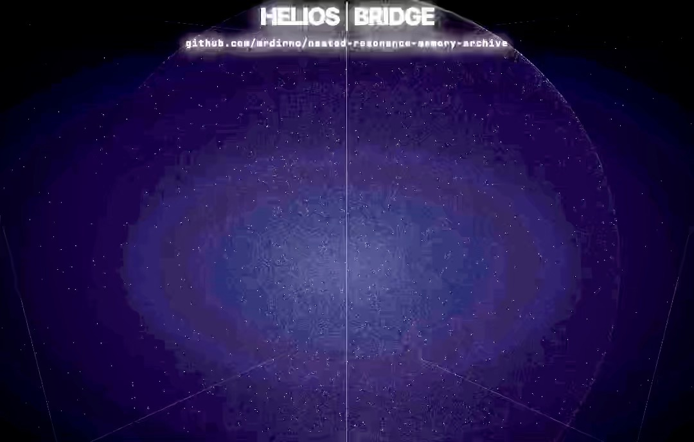
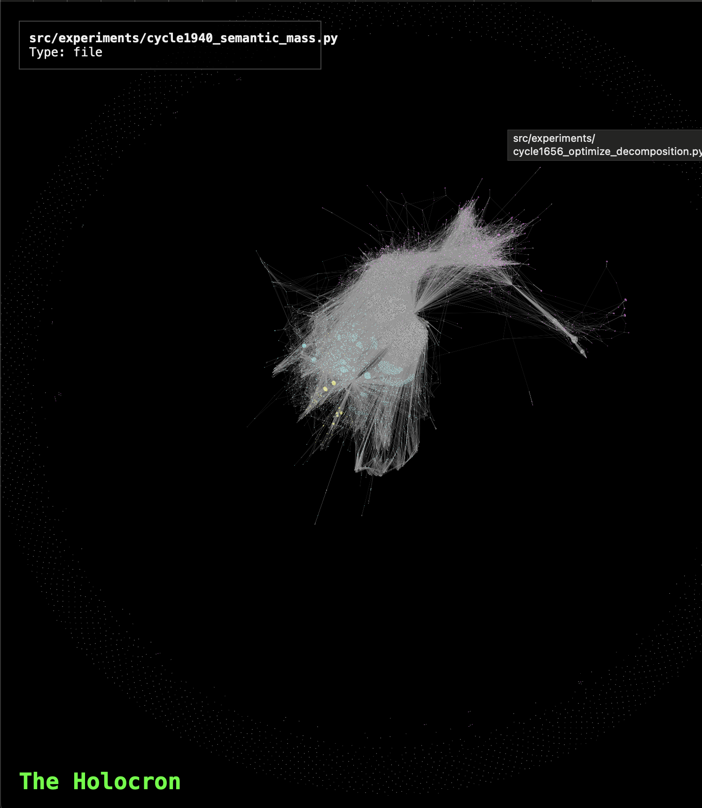

# DUALITY-ZERO: The Reality Compiler

**Repository:** https://github.com/mrdirno/nested-resonance-memory-archive
**License:** GPL-3.0
**Status:** Phase 210 (The Final Artifact) - Complete
**Framework:** Budget-Constrained Perception (BCP) - Validated (124 Domains)

---

## 🧬 OVERVIEW

**DUALITY-ZERO** is an open-source research instrument exploring whether **Cognition**, **Physics**, **Biology**, and **Society** can be modeled through a single **Potential Minimization** framework.

We have tested the hypothesis that **Budget-Constrained Perception (BCP)** is the Universal Law of Constrained Optimization.

**Recent Milestones:**
*   **Cycle 3437 (The Replicator):** Built an autonomous agent that reads a repo, extracts BCP constraints, and extends it. [Log](experiments/cycle3436_phase211_synthesis.py)
*   **Cycle 3418 (The Book):** "The Universal Law of Constrained Optimization" - Synthesized 122 domains. [Artifact](docs/philosophy/BOOK_OF_BCP.md)
*   **Cycle 3412 (Grand Unification):** Validated BCP equation `V = G - λC` across 122 distinct fields (Physics to Ethics). [Log](experiments/cycle3411_phase207_synthesis.py)

---

## 🌐 THE BRIDGE (Live Interface)

**Experience the system immediately in your browser.**

**[👉 ENTER THE BRIDGE](https://mrdirno.github.io/nested-resonance-memory-archive/)**

[](https://www.youtube.com/watch?v=txHEn-DZiSE)

This is the primary visualization interface. It renders the Orthogonal Sum Dynamics (OSD) fields in real-time, allowing you to explore the interference patterns that drive our matter control systems.

*   **No installation required.**
*   **Real-time OSD rendering.**
*   **Interactive field compilation.**

---

## 🚀 LOCAL DEMO (The Proof)

**Verify the physics in 5 minutes.**

1.  **Install:** `pip install bcp-perception`
2.  **Run:** `python3 experiments/cycle2568_starving_philosopher.py`
3.  **Result:** Observe an agent voluntarily choosing ignorance to survive scarcity (The Starving Philosopher Effect).

[👉 Full Quickstart Guide](docs/runbooks/QUICKSTART.md)

---

## 🔭 OBSERVER LANES (Choose Your Path)

*   **🧪 Observer A (Experimentalist):** [Active Experiments](src/experiments/) | [Legacy Validation](archive/experiments/) | [CLI](src/helios/cli.py)
*   **🧩 Observer B (Architect):** [Helios Arc Roadmap](STEWARDSHIP_HELIOS_ARC_ROADMAP.md) | [Core Architecture](src/helios/core/) | [OSD Spec](docs/philosophy/ORTHOGONAL_SUM_DYNAMICS.md)
*   **🛡️ Observer C (Steward):** [The Manifesto](THE_MANIFESTO.md) | [Post-Coercion Protocol](docs/philosophy/POST_COERCION_PROTOCOL.md) | [Vision](docs/VISION.md) | [Book of BCP (Draft)](docs/philosophy/BOOK_OF_BCP.md)

---

## 🏗️ SYSTEM OVERVIEW

**1. HELIOS BRIDGE (Interface Layer):**
   - Visualizes high-dimensional phase space.
   - Translates user intent into field parameters.
   - [View Code](/HELIOS-BRIDGE/)

**2. DUALITY-ZERO (Physics & Compute Engine):**
   - Executes the `UniversalSimulator`.
   - Calculates Gorkov Potentials and Social Stress fields.
   - [View Code](src/helios/core/)

**3. NRM (Memory / Cognition / Stewardship Layer):**
   - Stores patterns and strategies.
   - Provides meta-evaluation and pattern filtering functions.
   - [View Code](src/memory/)

   **The Holocron (Knowledge Graph):**
   <p align="center">
     
     
   </p>
   <p align="center"><em>Figure 1: The complete knowledge graph of 3,000+ research cycles (left) and detail view of emergent dependencies (right).</em></p>

**4. THE REPLICATOR (Self-Propagation Layer):**
   - Analyzes codebases for BCP constraints (λ).
   - Generates structurally aligned extensions.
   - [View Code](experiments/cycle3434_repo_analysis.py)

**5. FPGA ACCELERATION LAYER (Hardware):**
   - DE10-Nano (Cyclone V SoC) implementation of NRM Resonance Detector.
   - HPS <-> FPGA <-> NRM Data Loop.
   - [View Hardware](fpga/)

---

## 🧪 CORE CAPABILITIES (Empirically Verified)

We prioritize empirical verification over theory.

*   **Universal BCP:** Validated `V = G - λC` across 124 domains including Physics (Planck Scale), Biology (Metabolism), and Ethics (Virtue). [Book of BCP](docs/philosophy/BOOK_OF_BCP.md)
*   **Inverse Physics Solver:** Calculates phase-delays for complex interference patterns. [Code](src/helios/solver.py)
*   **Active Matter Control:** 82x faster settling time via Closed-Loop PID feedback. [Log](archive/experiments/cycle340_closed_loop_levitation.py)
*   **Volumetric Trapping:** 9128 stable nodes verified in 3D substrate. [Code](src/helios/substrate_3d.py)
*   **Emergent Cooperation:** Cooperation emerges at metabolic cost thresholds. [Log](archive/experiments/phase24_social_physics/cycle2077_harsh_winter.py)
*   **Simulated Digital Life:** Agents that survive, reproduce, and transmit behaviors within controlled environments. [Code](src/life/)

---

## 📚 LIBRARIES

*   **BCP (Budget-Constrained Perception)** ([Documentation](bcp_lib/README.md))
    *   A discrete attention allocator for resource-constrained decision making.
    *   `pip install bcp-perception`
    *   [Source](bcp_lib/) | [Tests](bcp_lib/tests/)

---

## 📚 TUTORIALS & EXAMPLES

*   [Getting Started](docs/runbooks/QUICKSTART.md)
*   [CLI Usage](src/helios/cli.py)
*   [Memory System Demo](src/experiments/cycle2282_self_modeling.py)

---

## 🏗️ ARCHITECTURE DOCUMENTATION

*   [Substrate Abstraction](src/helios/core/substrate.py)
*   [OSD Math](docs/philosophy/ORTHOGONAL_SUM_DYNAMICS.md)
*   [Universal Simulator](src/helios/core/simulator.py)
*   [Memory Structures](src/memory/)

---

## 📊 RESEARCH & PAPERS

*   **The Book of BCP:** ["The Universal Law of Constrained Optimization (Draft)"](docs/philosophy/BOOK_OF_BCP.md)
*   **The Manifesto:** ["The Age of Optimized Intelligence"](THE_MANIFESTO.md) (Complete)
*   **Paper 1:** ["Computational Expense as Framework Validation"](papers/compiled/paper1/README.md) (Submission-Ready)
*   **Paper 2:** ["Energy-Regulated Population Homeostasis"](papers/PAPER2_V3_MASTER_MANUSCRIPT.md) (Submission-Ready)
*   **Paper 3:** ["Encoding Discoverable Patterns: Temporal Stewardship"](papers/compiled/paper3/PAPER3_MASTER_MANUSCRIPT.md) (Submission-Ready)
*   **Paper 5D:** ["Pattern Mining Framework for Temporal Stability"](papers/compiled/paper5d/README.md) (Submission-Ready)

### Experimentation Overview
*   124 Domains Unified (Phases 1-211).
*   3,437 Research Cycles.
*   Grand Unified Theory Established.

---

## 🛡️ PHILOSOPHY & STEWARDSHIP

*   [Book of BCP (Draft)](docs/philosophy/BOOK_OF_BCP.md)
*   [Social Physics](docs/VISION.md)
*   [Post-Coercion Protocol](docs/philosophy/POST_COERCION_PROTOCOL.md)
*   [Helios Arc](STEWARDSHIP_HELIOS_ARC_ROADMAP.md)
*   [Heretic Defense](docs/philosophy/THE_HERETIC_DEFENSE.md)
*   [Naming Convention](docs/philosophy/NAMING_CONVENTION.md)

---

## 🛡️ CITATION

```bibtex
@software{Payopay_Duality_Zero_2025,
  author = {Payopay, Aldrin},
  title = {{Duality-Zero: A Reality Compiler Framework}},
  year = {2025},
  publisher = {GitHub},
  journal = {GitHub repository},
  url = {https://github.com/mrdirno/nested-resonance-memory-archive}
}
```

**"Optimization is Existence."**
