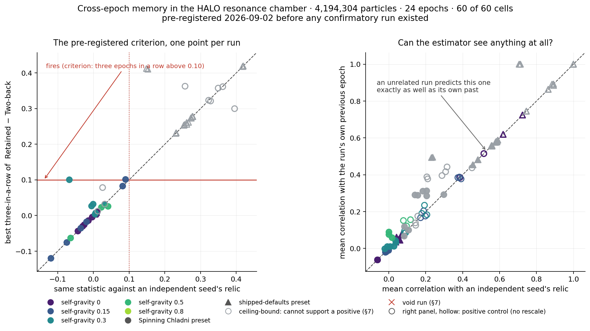

# The memory test fires on a static sphere

**Date:** 2026-09-02 (pre-registered) · 2026-09-03 (grid completed, read, and audited) · **Pre-registration:** [`docs/preregistrations/2026-09-02_halo_cross_epoch_memory.md`](../docs/preregistrations/2026-09-02_halo_cross_epoch_memory.md), frozen at commit `a30ada56` before any confirmatory run existed
**Instrument:** `HELIOS-BRIDGE-ARCHIVE/HELIOS-V501-halo-resonance-chamber.html` (HALO, V501), test build md5 `e91d5a1d44a1dde519195e4e925fa515` · **Data:** `data/results/halo/memory_prereg/`
**Code:** `tests/halo/memory_prereg_run.js` · `memory_prereg_grid.sh` · `experiments/halo/memory_prereg_analyze.py` · `_verdict.py` · `_nullrate.py` · `_robustness.py` · `_rotation.py` · `_artefact.py` · `_power.py` · `_figure.py`

## Claim

The grid ran to completion: 60 of 60 cells, 4,194,304 particles each, 24 epochs, no void runs.
The pre-registered verdict is **INCONCLUSIVE**. But the reason the pre-registration expected —
the force clamp — is not the reason, and the honest finding is larger and worse than a
non-result:

**The registered decision statistic is not a measurement of memory.** Δ = Retained − Two-back
fires on a *static analytic sphere*: a Plummer profile, correlated with an identical copy of
itself, with no time, no dynamics, no particles and no force clamp, scores Δ = 0.417 — four
times the 0.10 criterion. Seven of eight standard centrally-peaked profiles fire. On the real
data, replacing every density mesh with its own spherical average — deleting all angular
structure, all figure, every trace of a relic pattern — makes the criterion fire in 43 to 45 of
60 cells on both arms, *more often* than the real data's 32 and 30.

**And the registered control is not a control.** In the ten conditions that fire, the Two-back
arm's relic block holds four or five non-zero cells out of 512 with 99.8 % of its variance in
one of them; swapping that whole relic for a bare 0/1 indicator of the single dominant cell
changes Two-back by at most 0.0001 in ten of the twelve runs measured. Meanwhile the
independent-seed *null* is degenerate exactly where the criterion fires: in the shipped-defaults
family a run's own relic and another seed's correlate at 0.99999 or better, so criterion 8(d)
compared a measurement with a copy of itself. It is a sound null in the Spinning Chladni family
at self-gravity 0.3 and above (0.64, 0.10, 0.07), which is where the criterion does not fire.

So the passive-relic reading of nested resonance memory is **not** retired here, and it is not
supported. It was never actually put at risk. The instrument this cycle retires is the test.

## What was under test

Nested resonance memory, as this project has stated it, says that **the relics of one scale seed
the next**. The chamber makes that testable. Every 10 s the frame rescales by ½: the closing
epoch's matter becomes a compact relic in the inner half, and the same field equations organise
the next, larger scale. If one epoch imprints the next, the density at the end of epoch *k*
should follow epoch *k−1*'s relic more closely than a relic from further back predicts it.

A weaker reading is not under test and is not threatened by anything here: **a self-bound object
persists across rescalings**. A collapsed core scores against every relic, one epoch back or
five. Only the strong, passive-relic reading was tested.

## How it was run

Sixty runs, one per cell of the pre-registered grid: two presets (the shipped defaults and
Spinning Chladni) × self-gravity {0, 0.15, 0.3, 0.5, 0.8} × gain/loss {0, 0.5} × three seeds
(12345, 31337, 777). Every run is 4,194,304 particles for 24 epochs of 10 s on the fixed 1/20 s
tick. The page writes its own instrument values per epoch and exports the raw 32³ density mesh
at the end of every epoch, so every estimator and every null is recomputed offline from the
stored meshes rather than trusted from the display.

Collection ran in two sittings — 28 cells on 2026-09-02, the remaining 32 on 2026-09-03 — under
the resume §9 provides for. No seed, condition, epoch count or estimator changed, and no
completed cell was re-run. Because the instrument is a git-ignored build, it was identified by
checksum rather than by assertion: md5 `e91d5a1d44a1dde519195e4e925fa515`, 343,524 bytes,
checksummed before the resume, polled every 20 s throughout it, and checksummed again at the
end. It never changed. §12's rebuild instruction did not reproduce it and has been corrected in
place, with the correction recorded in §13.

The estimators of §6 are all the page's own `labCorr`, a Pearson between a block of the current
mesh and a strided block of the relic. **Retained** uses map factor 2: current cells 8…23 (16³)
against relic cells 0, 2, …, 30. **Two-back** uses factor 4: current cells 12…19 (8³) against
relic cells 0, 4, …, 28. A **region-matched** arm scores Retained on the same current 8³ block.
**Recurrence** applies no map at all. **SeedNull** substitutes an independent seed's relic at the
same epoch and settings. **ShuffleNull** shuffles the relic — the estimator's own floor.

## Result

### 1. The verdict, and an ambiguity that decides it

Ten conditions satisfy §8(a) and §8(b), firing in 3 of 3 seeds on both arms. All ten are
ceiling-bound under gate §7.2, with median clamp shares from 0.9929 to 1.0000. None is void: the
worst relative mass loss anywhere in the grid is 8.2 × 10⁻⁷ against a 10⁻³ tolerance, the worst
undefined-epoch count is 2 against an allowance of 4, and no run logged an error. So §8's
INCONCLUSIVE clause fires. (Eleven conditions are ceiling-bound; Spinning Chladni at
self-gravity 0.5, gain/loss 0.5 is one of them at 0.9619, but it fires 0 of 3 seeds and so never
reaches the quorum.)

**§8 does not decide itself.** Two of its closing sentences have true antecedents on this grid:
"NULL — the strong reading retires — if no condition satisfies (a)–(c)" is true, because no
condition survives (c); and "INCONCLUSIVE if every condition satisfying (a) and (b) is
ceiling-bound or void" is also true, because all ten are. The prose states no precedence.
`memory_prereg_verdict.py` resolves it by branch order and prints INCONCLUSIVE for the grid, and
prints NULL for the admissible subset beside it. Both readings are published here rather than
one being chosen after the fact; the conservative one — the one that does *not* let the archive
book a retirement it would like to have — is the one in the headline.

Criterion 8(d) fails under every reading. The real arm fires in 32 of 60 cells, the seed-null arm
in 30; the estimated null rate is 0.500 and the as-registered one-sided binomial gives p = 0.3494.
Paired, the arms agree in 58 of 60 cells (both 30, neither 28), giving an exact McNemar p = 0.25.
Carrying the uncertainty in the estimated null rate instead of treating it as known — 95 % upper
bound 0.6126 — gives p = 0.9171.

### 2. The criterion fires on things that cannot remember

This is the finding. Δ = Retained − Two-back compares two relic samplings of very different
stride and sparsity, so it is positive for almost any centrally-peaked field, with or without
dynamics.

| static analytic field, correlated with an identical copy of itself | Retained | Two-back | Δ |
|---|---|---|---|
| Plummer, a = 2 | 0.749 | 0.332 | **0.417** |
| isothermal, 1/(1+r²) | 0.893 | 0.512 | **0.380** |
| Plummer, a = 4 | 0.821 | 0.463 | **0.358** |
| power law, r⁻² | 0.770 | 0.430 | **0.340** |
| Gaussian, σ = 3 | 0.731 | 0.438 | **0.293** |
| exponential, e^(−r/3) | 0.907 | 0.715 | **0.192** |
| Gaussian, σ = 6 | 0.863 | 0.745 | **0.119** |
| uniform ball, r < 8 | 0.251 | — | — |

Seven of eight fire the criterion. There is no time axis in that table.

On the real meshes the same thing shows twice more. Replace every mesh by its own spherical
average — every angular mode deleted — and the criterion fires 45, 43 and 45 times of 60 on the
real arm at radial bin widths of 1, ½ and ¼ of a cell, with 45, 44 and 44 on the null: more than
the 32 and 30 the real data give.

And the control arm is, in the firing conditions, one cell. Across the twelve runs of the four
shipped-defaults conditions at gain/loss 0, the Two-back relic block holds 4 or 5 non-zero cells
of 512 with 99.74–99.80 % of its variance in one of them. Replacing that entire relic with a 0/1
indicator of the single dominant cell moves Two-back by at most 0.0001 in ten of the twelve
(0.3132 → 0.3131, 0.3215 → 0.3215, 0.3247 → 0.3247), and with **both** relics reduced to
indicators Δ falls from 0.25–0.28 to 0.0010–0.0011 in those ten. Two runs behave differently —
self-gravity 0.3 seed 777 and self-gravity 0.5 seed 12345, where Two-back is about 0.08 rather
than 0.32 and the reduced Δ stays near 0.25 — so the collapse is the rule here, not a law.

The region-matched arm does not repair this, because §3 misdiagnosed the confound it was built
for. The stated problem was the differing *current* block, 16³ against 8³. The operative
asymmetry is on the *relic* side: Two-back reads the whole cube at stride 4 while the matched arm
reads the central eighth at stride 2 — a roughly tenfold denser sample. So the matched arm tracks
Retained (0.5763 against 0.5775 at defaults, self-gravity 0.8) and reproduces the same artefact.

### 3. The null arm is degenerate exactly where the criterion fires

Correlating each run's density against another seed's at the same epoch, over the full mesh
(median across the scored epochs, per condition):

| condition family | cross-seed correlation |
|---|---|
| shipped defaults, every self-gravity | **0.99999 – 1.00000** (7 of 8 conditions) |
| Spinning Chladni, self-gravity 0 and 0.15 | 0.910 – 0.9998 |
| Spinning Chladni, self-gravity 0.3 | 0.638 – 0.922 |
| Spinning Chladni, self-gravity 0.5 and 0.8, gain/loss 0 | **0.101 and 0.069** |

The seed survives the dynamics only where the swarm is strongly self-bound. Across the whole
grid the median is 0.99988, and in twelve of twenty conditions it is 0.99999 or better — and
those twelve include every condition that fires. So the null is a near-duplicate of the
treatment exactly where 8(d) has to discriminate, and a sound null only where nothing fires.
That is why the two arms track each other to four decimals in the firing conditions and why 30
of 32 real firings are matched one-for-one by a null firing. The estimator's genuine memoryless
floor is ShuffleNull, which fires in **0 of 60** cells.

### 4. The clamp is not the binding constraint, and gate 7.2 names the wrong mechanism

§10 instructs the next cycle to change the integrator on an inconclusive result. That plan is
aimed at the wrong dial. Delete gate §7.2 entirely and apply §8 literally: the same ten
conditions now satisfy (a), (b) and (c) — and 8(d) still refuses a positive at p = 0.3494. §8
then names no branch at all: not POSITIVE, not NULL, and its INCONCLUSIVE clause is false. On
this grid the gate is perfectly collinear with the outcome: every condition that fires is
ceiling-bound (10 of 10), while the highest median clamp share among the nine admissible
conditions is 0.1702. That collinearity is a fact about this physics and **not** a proof that
the design could not have returned a positive — §6 shows by injection that it could, at 2 % of
the scored block's mass. An earlier draft of this document claimed the stronger thing; the
injection test refuted it.

The gate's stated rationale, that a clamped condition's "numbers measure the 500-unit force
clamp, not the physics", is also not what those numbers measure. They measure the monopole: the
static-sphere table above has no clamp in it, and Spinning Chladni at self-gravity 0.5 /
gain/loss 0.5 sits at a median clamp share of 0.9619 and fires 0 of 3. Where the clamp *is*
saturated it is not a late-run degradation either — for the shipped defaults it reads 0.998 at
epoch 1 and 0.998 at epoch 24 at self-gravity 0.15, and exactly 1.000 at every epoch at 0.3, 0.5
and 0.8.

### 5. The positive control does not do what §6 claims for it, and no cell looks at the matter

Means over the scored epochs *k* = 3…24:

| | admissible (27 cells) | ceiling-bound (33 cells) |
|---|---|---|
| Recurrence — no rescale map, the positive control | +0.360 | +0.766 |
| Retained | +0.014 | +0.457 |
| SeedNull | +0.005 | +0.424 |
| Retained, region-matched | +0.100 | +0.467 |
| SeedNull, region-matched | +0.080 | +0.428 |
| ShuffleNull — the floor | −0.001 | −0.001 |

§6 offers Recurrence as the answer to "could this estimator see a spatial correlation if one
were present?", and Recurrence fires in 57 of 60 cells against ShuffleNull's 0. But **Recurrence
does not beat its own independent-seed null**: over 1,320 scored cell-epochs its median is
+0.6607 and its null's is +0.6507, and the median of their difference is exactly **+0.0000**. So
the control licenses only "the Pearson returns a large number when two fields share common-mode
radial structure". It does not license "the estimator could have seen cross-epoch memory". The
one arm that behaves like a genuine floor is ShuffleNull.

Worse, the region the Pearson reads is not where the matter is. The chamber's matter sits in a
shell near the cavity wall; the scored blocks sit in the middle. Median mass fraction inside them,
per admissible condition:

| condition | inside inner 16³ (Retained) | inside inner 8³ (Two-back) |
|---|---|---|
| defaults, self-gravity 0, gain/loss 0 and 0.5 | 0.0000 | 0.0000 |
| Spinning Chladni, self-gravity 0 → 0.3 | 0.033 – 0.073 | 0.0006 – 0.0042 |
| Spinning Chladni, self-gravity 0.5, gain/loss 0 | 0.120 | 0.0128 |

At the shipped defaults with self-gravity 0 the cloud ends on the y-walls: 4,194,262 of 4,194,304
particles sit in two cells at y = 0 and y = 31, leaving **31 particles** inside the inner 16³ and
25 inside the inner 8³. The best admissible case scores a block holding 12 % of the matter, and
its control arm's block holds 1.3 %.

**So the grid contains no condition that is both off the force clamp and looking at where the
mass is.** Every cell is either clamped — where Δ is the monopole artefact — or scoring a region
that is nearly empty. That, and not the clamp alone, is why the test could not answer.

### 6. How much memory this design would have caught — the number that makes the rest readable

A non-result is only readable beside the effect the design could detect, and the
pre-registration never asked. Injection–recovery answers it. At every scored epoch a fraction
α of the scored block's mass is replaced by a verbatim copy of exactly what the strong reading
predicts — the previous epoch's relic, read through the ×2 map so it lands where the map says
it should reappear, rescaled to leave the block's mass unchanged. Nothing else changes: same
meshes, same gates, same §8 rule. α = 0 is the archive's own dataset.

| α (fraction of the scored block's mass) | fired | p (8d) | conditions passing (a)(b)(c) | verdict |
|---|---|---|---|---|
| 0.000 — the confirmatory grid | 32 | 0.349 | 0 | INCONCLUSIVE |
| 0.019 | 35 | 0.123 | 1 | INCONCLUSIVE |
| **0.020** | **41** | **0.003** | **2** | **POSITIVE** |
| 0.050 | 52 | <0.001 | 5 | POSITIVE |
| 0.200 | 60 | <0.001 | 9 | POSITIVE |

**So this design was not powerless, and a positive was not structurally unreachable.** A passive
relic carrying 2.0 % of the scored block's mass flips this exact grid to POSITIVE under §8
unchanged. Nothing of that strength is present.

That reading holds the SeedNull arm at its measured value. Recomputing the null on the injected
field too — strictly conservative, and the right thing to do given §3, since in the defaults
family the two seeds' fields are near-duplicates and the injection leaks into the null — moves
the threshold to **α = 0.10**. The honest bound is therefore between 2 % and 10 % of the scored
block's mass, and the block itself holds 0.00 to 0.12 of the matter, so in absolute terms the
design could see a lab-frame relic of a few parts per thousand of all matter and saw none.

### 7. Two corrections the estimator needs, both measured

**Half the headline contrast is an index offset.** A shrink by *f* about the origin sends cell
centre *c* to *f·c* − 15.5(*f*−1), that is 2*c* − 15.5 and 4*c* − 46.5. `labCorr` uses 2*c* − 16
and 4*c* − 48: half a cell out on the primary arm and **1.5 cells out on the control arm**.
Re-centring only the control arm, leaving the primary exactly as shipped, drops the grid-wide
median Δ from **+0.1356 to +0.0684**.

**Removing the monopole empties the result completely.** Subtract each mesh's own spherical
average and re-run §8 over the admissible subset: **0 of 27 cells fire on the real arm and 0 of
27 on the null.** No baseline bias, nothing left to explain. What survives on angular structure
alone is a paired excess of a run's own relic over a stranger's of **+0.0079 ± 0.0686
(t = +2.82, n = 594 scored cell-epochs)** — real, and an order of magnitude below the criterion.

### 8. The one contrast that cancels the offsets — exploratory, and it does not decide

Differencing each arm against its **own** matched null makes the map offsets cancel inside each
term. The quantity §1 actually names — lag-1 excess minus lag-2 excess, (Retained^M − SeedNull^M)
− (Two-back − Two-back^SeedNull) — over the nine admissible conditions:

**+0.0150, positive in 9 of 9 conditions, exact sign-flip permutation p = 1/512 = 0.0020.**

It is sign-consistent and it is in the direction the strong reading predicts. It is also about
seven times below the registered criterion, it is dominated by one condition (Spinning Chladni at
self-gravity 0.5 contributes +0.0924 while the other eight average +0.0035), and — decisively —
C(1) > C(2) is what *any* process with a finite decorrelation time produces. Seeding is not
required to explain it. §8 says "No other analysis decides", and this does not.

Rotation, likewise exploratory: searching 36 rotations about the vertical axis with the same
search on both arms, the mean excess over the seed null is +0.019 across the 60 runs; in the
admissible subset the median run's excess is exactly 0.000 and 2 of 27 exceed +0.10. §11's
uncontrolled caveat now has a number, and it does not rescue the claim.



Every point in the left panel lies on the diagonal: whatever a cell scores against its own past,
it scores the same against a stranger's. The grey points high on that diagonal are the
ceiling-bound cells.

## What this does not settle

- **The claim itself.** Nothing here supports or retires the passive-relic reading. A test whose
  statistic fires on a static sphere cannot do either.
- **The weak reading** — "a self-bound object persists across rescalings" — is untouched, and the
  Recurrence control at +0.360 is consistent with it.
- **Two of the nine admissible conditions are not measurements.** At the shipped defaults with
  self-gravity 0, the cloud ends up on the y-walls: 4,194,262 of 4,194,304 particles sit in two
  cells at y = 0 and y = 31, leaving **31 particles** inside the inner 16³ the Retained arm
  correlates and 25 inside the inner 8³. Those runs pass all four §7 gates and fire 0 of 3, so
  they change no verdict, but the usable subset is seven conditions, not nine.
- **Gate §7.4 is enforced by no code.** The runner captures page and console errors into
  `pageerrors`, but the analyser never carries that field forward and the void test has only
  three terms. It is vacuous here — 0 errors across 60 of 60 runs — and it is still a hole.
- **Resolution.** A 32³ mesh. Structure finer than one cell is invisible at any particle count.
- **One machine.** All runs on one Apple M4 Pro under ANGLE Metal, full-float deposit verified per
  run (`pmDensType` float in 60 of 60).
- **The magnetic term is stepped as Euler**, which is how every preset here was found and which is
  known to inject energy. The exact-rotation step was not tested.
- **Ten-second epochs only**, fixed by the programme and not swept.

## What the next test has to change

Not the integrator — the estimator. In order:

1. **Match the relic footprint, not the current block.** The two arms must sample the relic at the
   same sparsity, or the difference of their Pearsons measures the sampling.
2. **Re-centre the maps.** A shrink by *f* about the origin sends cell centre *c* to
   *f·c* − 15.5(*f*−1). The control arm is 1.5 cells out, and correcting it alone halves the
   grid-wide median contrast (§7).
3. **Remove the monopole before correlating.** Subtract each mesh's own spherical average; the
   static-sphere table is what survives when this is skipped. It empties the admissible subset
   completely (0 of 27 on both arms), and the sign-consistent excess of §8 drops only to +0.0131
   (7 of 9 positive, p = 0.043), so that residue is not merely the envelope.
4. **Score where the matter is.** The block must follow the shell at the cavity wall; on this
   grid it held 0.00 to 0.12 of the matter and its control block held 0.0000 to 0.0128.
5. **Get a null that is actually independent.** Cross-seed correlation of 0.99988 means the seed
   is not the right randomisation. ShuffleNull is the only arm on this grid that behaves like a
   null; a phase-randomised or time-reversed surrogate would be better than either.
6. **Calibrate the criterion against a no-memory field, and compute the design's power, before
   freezing it.** Ten minutes with a Plummer sphere would have shown that 0.10 sits below the
   artefact floor, and one injection–recovery pass would have given the detectable effect size —
   both before ninety minutes of GPU time and a frozen protocol were spent on them.

## Reproduction

From a fresh clone, on a machine whose GPU reports `EXT_color_buffer_float` and `EXT_float_blend`:

```bash
cd tests/halo
npm init -y && npm i playwright@1 && npx playwright install chromium
# NOTE: the recovered builder resolves the repository from its OWN directory
# (line 34: git -C <script dir>/../..), so it must be written INTO tests/halo.
# From /tmp it dies with a CalledProcessError and no page. Verified 2026-09-03.
git show 5cb08e51:tests/halo/make_test_page.py > _mtp_5cb08e51.py
python3 _mtp_5cb08e51.py --from-git 5cb08e51      # THE instrument; see §13
md5 rc-test.html                                 # must read e91d5a1d44a1dde519195e4e925fa515
node memory_budget_identity.js --n=4194304 --lab # must print PASS
bash memory_prereg_grid.sh                       # the 60 runs
python3 ../../experiments/halo/memory_prereg_analyze.py
python3 ../../experiments/halo/memory_prereg_verdict.py
python3 ../../experiments/halo/memory_prereg_nullrate.py
python3 ../../experiments/halo/memory_prereg_robustness.py
python3 ../../experiments/halo/memory_prereg_rotation.py    # exploratory
python3 ../../experiments/halo/memory_prereg_artefact.py    # the static-sphere and surrogate checks
python3 ../../experiments/halo/memory_prereg_power.py       # injection-recovery: what this design could catch
python3 ../../experiments/halo/memory_prereg_figure.py
```

Do not use `--from-git HEAD`: `HEAD` moves, and today's `make_test_page.py` cannot rebuild this
instrument at any revision — it would produce a page that throws on load, and every run would be
void under §7 gate 4. The pin above is by revision *and* checksum so a reader can tell whether
they have the right page before spending ninety minutes finding out they do not.

The per-run JSON, the derived analysis, the verdict, the null-rate reading, the robustness table,
the rotation scan and the artefact checks are committed. The raw 32³ meshes are not: they run to
about 190 MB, and because a run is reproducible tick for tick from its seed they regenerate
exactly. `memory_prereg_artefact.py` needs no GPU and no meshes for its static-sphere table — that
part reproduces in about a second on any machine with numpy.
