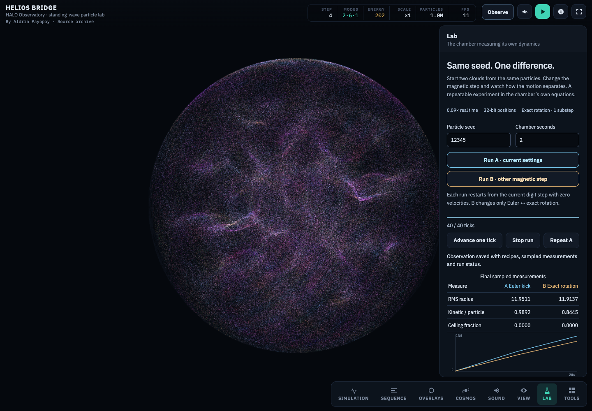
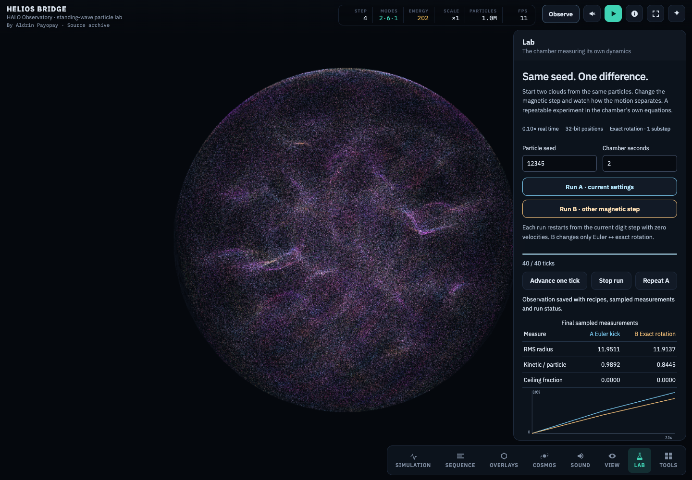

# HALO Observatory release record — September 5, 2026

Author: Aldrin Payopay · GPL-3.0-only

HALO now has a reproducible observation bench: seeded starts, paired magnetic integrators, exact tick stops, sampled energy/radius/force-ceiling measurements, and downloadable recipes that can be replayed. Its existing spherical-cavity engine and historical presets remain the computational model. [Use the bench](../../docs/halo/OBSERVATORY.md) · [Structured local receipts](2026-09-05_halo_observatory.json)

**Published and verified:** [Pages deployment](https://github.com/mrdirno/nested-resonance-memory-archive/actions/runs/33955862126) and [all nine hosted HALO suites](https://github.com/mrdirno/nested-resonance-memory-archive/actions/runs/33955862162) pass at commit `bcb323e0`. Both worker receipts match the exact HTML served publicly. The [live record](2026-09-05_halo_live.json) includes the one-million-particle A/B download, source hash, screenshots and separate interactive inspection. Later commits contain archive/data records rather than a changed HALO engine.

## Numerical and interaction evidence

Nine sequential browser/numerical suites passed locally: tick, observation, Lab, UI smoke, integrator, mesh, conservation, dimer and numerical bench. The 24 observation checks include full small-count GPU position/velocity equality on replay, zero magnetic coupling as a negative control, warm mesh/probe reset, actual JSON download/import, interruption paths, invalid settings, keyboard input and reduced motion. The numerical bench also loads the real NPZ export in NumPy and compares the orbit and periodic mesh behavior with independent computations.

The full local suites measured source `e0fc351eb46cce21f2d9e4a4a594b23d308b9a522318f9df593fc6ddbfb2d0a5`. A subsequent CSS-only correction makes the sticky Lab heading opaque and keeps the navigation on one row where its 44px targets fit; every inline script remained byte-identical. The first published commit carried source `87bfc66c17cc359d76bd2e40a041032d175e6834b01694aa5564b19bc88c3769`; its 24 observation checks and served-page test passed locally. The hosted gate then exposed a navigation overlap and refused deployment, as recorded below.

The served-page check uses the actual production HTML, without the probe bridge: 1,048,576 particles, seed 12345, two 40-tick runs, matching sampled initial states, finite endpoints, a downloaded record, mobile bounds and zero JavaScript page errors. Chromium software rendering and the in-app browser were both used for visual inspection. The screenshot above is from that local production preview, not a claimed new scientific result.

Optional old-versus-new OFF-equivalence checks had no historical probe build and were skipped; their substantive solver/conservation assertions ran. The observation fingerprint is only a small-sample diagnostic. Device arithmetic can differ. Nothing here is a new full-count memory campaign or evidence that validates NRM.

## Software and archive changes

The classic Bridge now runs TypeScript checking before its Vite build. The touch-control constant, icon prop typing and numeric overlay values were corrected. Compatible dependency updates reduced its npm advisory count from eight to zero at this measurement. Obsolete client-side API-key substitutions were removed after finding no callers. The production build passes, but its roughly 334 kB compressed JavaScript chunk still warrants a measured loading-performance review.

The lifecycle map covers HALO, the classic Bridge, creative/practical tools, BCP, research code, papers, hardware and historical copies. The 500 visual studies are preserved as a creative collection, with clear limits on their physics labels. Provisional drafts retain original bytes and provenance; the dormant SEVEN integration retains its source and patch with the observed anonymous authorization failure documented. Eight prohibited tracked artifact paths were preserved privately and removed from the current index. Earlier Git history was not rewritten.

Archive boundary and cleanup checks pass (11 real-filesystem/Git tests; zero cleanup candidates). Eight existing fractal, memory and reality checks also pass in an isolated copy, with real SQLite and grounded psutil readings; [the receipt](2026-09-05_nrm_core_check.txt) states the limited scope. Workflow validation passes with actionlint 1.7.12 and shellcheck 0.11.0, installed through Homebrew for this review. BCP monitoring/plotting repairs pass 55 tests with 95.93% whole-package coverage; the [stewardship report](2026-09-04_archive_stewardship.md) preserves the initial 49.55% baseline and the new evidence. No package release was attempted.

## Publication status

The [first hosted HALO gate](https://github.com/mrdirno/nested-resonance-memory-archive/actions/runs/33952410864) timed out at Lab activation. Its retries exposed a real interaction defect: the bottom navigation covered the Lab switch after scrolling. The final retry reached pointer dispatch, so the overlap alone did not establish the cause of the terminal timeout. A new pointer-target regression failed on that source at 1280×800. The repair places desktop panels above the navigation and reserves scrolling space for the header and mobile navigation. All 28 observation checks now pass, including actual clicks at 1280×800, 900×600, 360×844 and 390×844. The served one-million-particle A/B check passed again. The repaired source is `e515335b1d4159b396779a9b3e3bac6132a6b24b2434eb8b20cf4710763724ea`; every inline script is byte-identical to the first commit.

The [second hosted run](https://github.com/mrdirno/nested-resonance-memory-archive/actions/runs/33953336199) passed tick, all 28 observation checks and Lab, then timed out again during Lab activation in smoke, without navigation interception. A full local smoke passed on this repaired CSS. Lab activation synchronously reads GPU textures; the smoke harness now records its handler and action duration with a bounded 120-second readback allowance. This measures the suspected hosted stall; it does not change the production handler or establish acceptable interaction latency.

The [focused core workflow](https://github.com/mrdirno/nested-resonance-memory-archive/actions/runs/33953813071) passes all eight checks on Python 3.10 and 3.13, plus explicit real-host grounding. Its SQLite fixtures now use isolated temporary directories; a pre-existing file at the old deletion path survived unchanged.

Main pushes now enter the reusable HALO checks through Pages once, removing the duplicate standalone push job. A parallel maintenance commit, `20b62dcc`, made the site build independent of those checks so other tools can publish. Pull-request and manual checks remain available. Deployment and instrument health are separate receipts. The site was first published by commit `20b62dcc` while its instrument check was still running. The [live record](2026-09-05_halo_live.json) verifies HTTP 200 and source SHA-256 `e515335b1d4159b396779a9b3e3bac6132a6b24b2434eb8b20cf4710763724ea`, a served one-million-particle A/B record, and a separate in-app browser inspection of both HALO and the classic Bridge. Both interactive HALO arms stopped at 40 ticks. The classic production bundle matches the locally built SHA-256. Instrument CI is recorded independently below.

The [timed hosted run](https://github.com/mrdirno/nested-resonance-memory-archive/actions/runs/33954296682) isolated the stall: the Lab activation handler took 58,562 ms and its pointer action 71,314 ms, then the next meter read timed out. Source inspection showed that the `spinexact` preset had replaced the smoke initializer's 20,000 particles with its intentional 4,169,000-particle setting. The revised smoke asserts that preset count, then uses the actual numeric count control to rebuild a 20,000-particle texture before testing Lab interaction. This corrects the test's unstated workload escalation; it does not improve large-count software-rendering responsiveness. UI and numerical groups now use independent hosted workers, with sequential suites and source-bound receipts inside each worker, so a UI failure cannot hide numerical evidence. The final workflow runs separately from Pages and triggers only for instrument changes; it therefore cannot hold later toolkit deployments in the Pages concurrency queue. The corrected full smoke passes locally after restoring the intended UI budget.

The final inventory review also found an unpacked slicer project containing real machine configuration. Eleven files were preserved privately and removed from the public index. Together with the earlier eight removals, 19 prohibited artifact paths were addressed; original Git history was not rewritten. The guard now recognizes slicer-profile keys and standard unpacked project XML, with 13 filesystem tests. Lifecycle coverage includes known root metadata and legacy helpers with experimental/dormant boundaries intact.

The final hosted smoke passed with its intended 20,000-particle workload. Lab activation took 5,379 ms inside the handler and 10,789 ms for the pointer action on that software-rendered worker; the production handler was not changed. Its earlier 4,169,000-particle stall remains a performance limitation, not a result erased by a larger timeout. The full five-suite numerical worker passed independently. A superseded workflow whose site had already deployed was cancelled; that cancellation is not counted as validation.

Archive health passes the expanded 13-test guard. All 19,308 indexed paths after the input-audit commit have coverage across 17 lifecycle entries, with zero unclassified paths and zero detected publication violations. This counts classification, not fresh runtime verification of every historical component. The [nine-run input audit](2026-09-05_halo_memory_input_integrity.md) verifies 18 hashes, 7,077,888 finite nonnegative cells and 216 positive epoch totals; it produces no memory estimate.

## Remaining research and maintenance

A valid memory estimator still needs centered and matched spatial support, radial controls, null checks and measured injection recovery before a new protocol is frozen. The [qualification plan](../../docs/halo/NEXT_MEMORY_ESTIMATOR.md) identifies nine existing runs; their 18 raw/JSON inputs have been preserved and hashed in DEV without running a new analysis. The four stale root artifacts were preserved or deduplicated in a [bounded cleanup](2026-09-05_root_artifact_cleanup.md). Unclassified archive files and unverified dormant projects remain visible obligations in the inventory. Coverage and lifecycle labels do not certify the entire repository or its historical claims.
